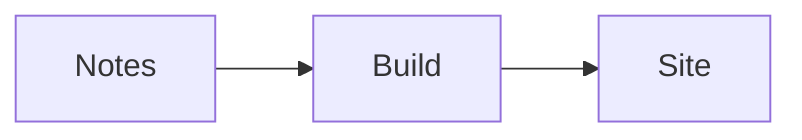

# mdpublish

Turn a folder of Markdown notes into a static website. `mdpublish` understands
ordinary Markdown links and images as well as the most common Obsidian link
syntax, and generates navigation from the folder structure.

## Quick start

Node.js 20 or newer is required.

```sh
npm install
npm run build
node dist/cli.js build ./my-vault --out ./site
```

Serve the resulting `site` directory with any static web server. During
writing, use the development server with automatic rebuilds:

```sh
node dist/cli.js dev ./my-vault --out ./site
```

The server listens on all network interfaces at port `4173`, so the site is
available locally at <http://127.0.0.1:4173/> and through the machine's LAN or
Tailscale IP. Run `npm link` if you want to use `mdpublish` as a command while
developing it.

## Supported content

- Markdown links: `[Guide](Guides/Guide.md)`
- Markdown images: ``
- Wikilinks: `[[Guide]]`, `[[Guides/Guide]]`, and `[[Guide|Read the guide]]`
- Heading links: `[[Guide#Installation]]`
- Obsidian image embeds: `![[diagram.png]]` and `![[diagram.png|640]]`
- YAML frontmatter
- Tables, task lists, fenced code, blockquotes, and other standard Markdown
- Obsidian callouts such as `> [!tip]`, `> [!success]`, and `> [!error]`
- Syntax highlighting for fenced code blocks with a language name
- Inline `$...$` and display `$$...$$` LaTeX rendered with KaTeX
- Mermaid diagrams in `mermaid` code fences

Wikilinks can use a path from the current note, a path from the vault root, or
a unique filename. Ambiguous and missing references are reported as warnings.
Inside table cells, `<br>`, `<br/>`, and `<br />` are rendered as line breaks.
Raw HTML remains escaped elsewhere.

### Frontmatter

```yaml
---
title: A custom page title
order: 10
nav: true
draft: false
---
```

- `title` overrides the filename-derived page title.
- `order` controls page order within a navigation folder.
- `nav: false` publishes the page without adding it to navigation.
- `draft: true` or `publish: false` excludes the page.

The page title is always rendered above the Markdown article. It comes from the
original filename unless frontmatter supplies `title`. Markdown headings,
including H1 headings, remain part of the article and appear in its outline.

## Callouts, code, math, and diagrams

Callouts use Obsidian's blockquote syntax. The label after the type is optional:

```markdown
> [!tip] A useful title
> Callout content can contain **Markdown**.

> [!error]
> Something went wrong.
```

Common callout types include `note`, `info`, `tip`, `success`, `question`,
`warning`, `failure`, `danger`, `error`, `bug`, `example`, and `quote`, along
with their usual Obsidian aliases.

Add a language after the opening fence for highlighted code:

````markdown
```ts
const published = true;
```
````

Math uses dollar delimiters:

```markdown
Euler wrote $e^{i\pi} + 1 = 0$.

$$
\int_0^1 x^2 \, dx = \frac{1}{3}
$$
```

Mermaid uses a named code fence:

````markdown

````

KaTeX fonts and Mermaid are copied into the output bundle, so these features do
not depend on third-party CDNs.

## Configuring navigation

By default, every published page except those with `nav: false` appears in the
folder-based navigation. To choose exactly which pages and folders appear, add
`mdpublish.config.json` to the root of the vault:

```json
{
  "title": "My published notes",
  "welcome": "Home.md",
  "navigation": [
    "Home.md",
    {
      "path": "Guides/",
      "label": "User guides"
    },
    {
      "path": "Reference/API.md",
      "label": "API"
    }
  ]
}
```

`title` sets the site name shown above the sidebar and used in browser tab
titles. The command-line `--title` option overrides it when both are supplied;
otherwise the input folder name is used as the fallback.

`welcome` selects the page published at the site root. It accepts a vault-root
page path, with or without the `.md` extension. If another page such as
`Home.md` would normally own `/`, that page moves to its filename route. The
configured welcome page is published only at `/`, and all generated links to it
use that URL.

Entries appear in the listed order. A page entry adds that page; a folder entry
adds the folder and recursively expands its visible pages and subfolders. Use a
trailing slash to explicitly select a folder if a page and folder share a name.
Pages omitted from the list are still published and linkable, but do not appear
in navigation. `nav: false` hides a page when a folder entry is expanded; an
explicit page entry can still include it. Missing entries generate build
warnings. The configuration file itself is never copied into the published
site.

`Home.md`, `README.md`, or `index.md` becomes its folder's landing page. Two
such files in the same folder are treated as a route collision.

## Hosting below a subpath

For a site hosted at a URL such as `https://example.com/notes/`, set the base
path at build time:

```sh
mdpublish build ./my-vault --out ./site --base /notes/
```

The output contains only HTML, CSS, JavaScript, and your copied attachments; it
does not require a server-side runtime.
